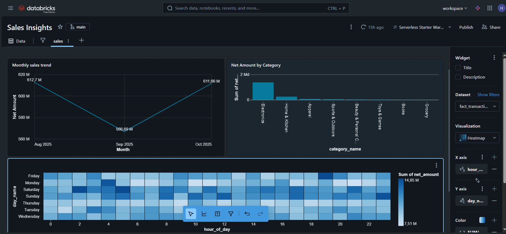

# 🚀 Projet Data + AI sur Databricks – Pipeline Lakehouse Complet (Bronze/Silver/Gold + Dashboard + MLflow)


---

# 📚 Table des Matières

* [📖 Description du Projet](#-description-du-projet)
* [🎯 Objectifs](#-objectifs)
* [🧱 Architecture du Pipeline](#-architecture-du-pipeline)
* [🛠️ Technologies Utilisées](#️-technologies-utilisées)
* [📂 Structure du Dépôt](#-structure-du-dépôt)
* [📊 Détails du Pipeline](#-détails-du-pipeline)

  * Bronze
  * Silver
  * Gold
  * Dashboard
  * EDA
* [📈 Résultats](#-résultats)
* [📸 Captures ](#-captures--gif-dashboard)
* [📘 Références](#-références)
* [👤 Auteur](#-auteur)

---

# 📖 Description du Projet

Ce projet met en place un pipeline **Data + AI complet** sur Databricks.
L’objectif : construire une architecture **Lakehouse** moderne permettant d’ingérer, transformer, visualiser et modéliser des données dans un flux entièrement automatisé.


---

# 🎯 Objectifs

* Automatisation de l’ingestion via **Auto Loader**
* Structuration des données en **Bronze → Silver → Gold**
* Création d’un **dashboard interactif** Databricks
* Analyse exploratoire (EDA) des données

---

# 🧱 Architecture du Pipeline

```
 Sources → Bronze → Silver → Gold → Dashboard 
```

Graphique complet :

```
       +-------------+
       |   Sources   |
       +------+------+
              |
              v
     +--------+---------+
     |  Bronze Layer    |
     | (Raw / Ingestion)|
     +--------+---------+
              |
              v
     +--------+---------+
     | Silver Layer     |
     | (Cleaned Data)   |
     +--------+---------+
              |
              v
     +--------+---------+
     | Gold Layer       |
     | (KPIs / Features)|
     +--------+---------+
              |
       +------+------+
       | Dashboard  |
       +------+------+
             
```

---

# 🛠️ Technologies Utilisées

| Technologie                      | Rôle                                  |
| -------------------------------- | ------------------------------------- |
| **Databricks Community Edition** | Workspace, clusters                   |
| **PySpark / Spark SQL**          | Transformations et calculs            |
| **Delta Lake**                   | Format ACID & Bronze/Silver/Gold      |
| **Auto Loader**                  | Ingestion continue                    |
| **Databricks SQL Dashboard**     | Visualisations & KPIs                 |
| **MLflow**                       | Tracking, Model Registry, déploiement |
| **Python**                       | Scripts & notebooks                   |

---

# 📂 Structure du Dépôt

```
📁 project_ecommerce/
│
│
├── 0_data/                         
│   ├── brands/
│   ├── category/
│   ├── customers/
│   ├── date/
│   ├── order_items/
│   └── products/
│
├── 1_setup/                         
│   └──  setup_catalog
│
├── 2_medallion_processing_dim/      # Traitement Silver → Gold (DIM tables)
│   ├── 1_dim_bronze.ipynb
│   ├── 2_dim_ilver.ipynb
│   └──  3_dim_gold.ipynb
│   
│
├── 3_medallion_processing_fact/     
│   ├── 1_fact_bronze.ipynb
│   ├── 2_fact_silver.ipynb
│   └──  3_fact_gold.ipynb
│
├── 4_genie_exploration/             
│   └──  questions.txt
│
└── 5_dashboard/                          
    ├── dashboard.png 
    ├── dashboard_view
    └── Sales Insights              


```

---

# 📊 Détails du Pipeline

## 🔹 1. Bronze – Ingestion

* Auto Loader
* Stockage brut en Delta
* Schéma évolutif automatique

## 🔹 2. Silver – Nettoyage

* Qualité des données
* Standardisation
* Typage & déduplication

## 🔹 3. Gold – KPI et Tables analytiques

* Agrégations
* Tables prêtes BI & ML
* Features engineering

## 🔹 4. Dashboard Databricks

Dashboard créé à partir des tables **Gold** :

* KPI dynamiques
* Graphiques interactifs
* Mise à jour automatique via Delta Live

## 🔹 5. EDA

Visualisations depuis les notebooks :

* distributions
* corrélations
* valeurs manquantes


---

# 📈 Résultats

* Pipeline Lakehouse **entièrement automatisé**
* Dashboard professionnel et interactif


---

# 📸 Captures 

### 📊 Dashboard – Aperçu (image)





---

# 📘 Références

* Tutoriel suivi :
  **“Databricks Free Edition Tutorial with End-to-End Data + AI Project | Free Crash Course”**
* Documentation Databricks : [https://docs.databricks.com/](https://docs.databricks.com/)
* Documentation MLflow : [https://mlflow.org/](https://mlflow.org/)
* Tutoriel utilisé comme base du projet :
  **“Databricks Free Edition Tutorial with End-to-End Data + AI Project | Free Crash Course”** (YouTube)

---

# 👤 Auteur

**Hamza**
Ingénieur Informatique – Data Science & Machine Learning
🔗 Passionné par Databricks, Lakehouse, Cloud & Modern Data Stack

---


